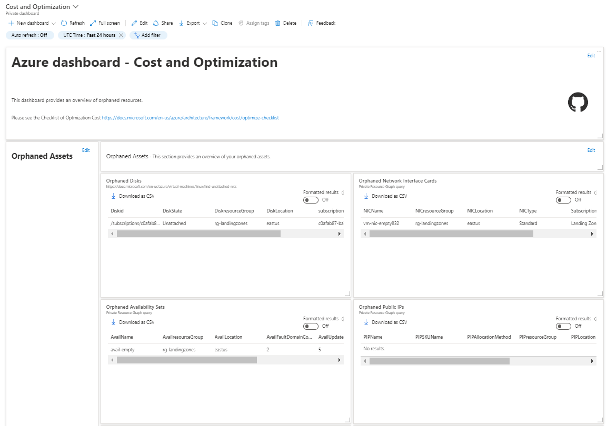

# **Cost and Optimization Dashboard**

This dashboard can be used to help us to save money, identify orphaned assets, status running and reserved instance, if applicable.

Microsoft recommend that we use a guide of **Microsoft Azure Well-Architected Framework** 
https://docs.microsoft.com/en-us/azure/architecture/framework/cost/overview

## Change Log

### 4.2.0 - 06/12/2022
- Added in Orphaned Assets the Route Table query.
#### Added
- Added Route Table query

### 4.1.0 - 06/10/2022
- Added SQLDBName in Azure SQL Managed Instances without Azure Hybrid Benefit.
#### Added
- Added SQLDBName field

### 4.0.0 - 06/03/2022
- Added new subjects links.
#### Fixed
- Query for Linux VMs without Azure Hybrid Benefit enabled, applicable for RedHat and Suse only

### 3.1.0 - 06/01/2022
- Added Assets Overview session.
#### Added
- Assets Overview session

### 3.0.0 - 06/01/2022
- Added query for AKS State and a new Azure Hybrid Benefit session.
#### Added
- Query for Azure Kubernetes Service Power State on Assets to Evaluate session
- Azure Hybrid Benefits session

## Dashboard overview

](./images/CostandOptimizationImage_Part1.png)

Thank you for your visit!
